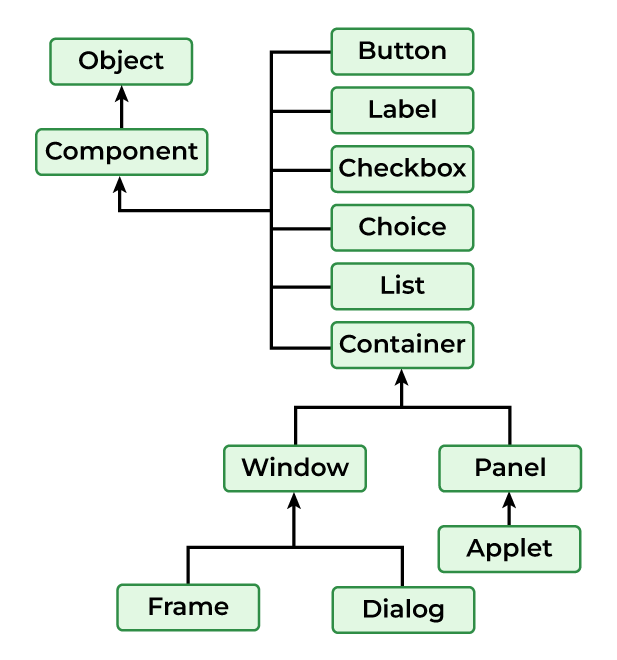

# Event Driven Programming
Graphics programming - Frame – Components - working with 2D shapes - Using colour, fonts, and
images - Basics of event handling - event handlers - adapter classes - actions - mouse events - AWT
event hierarchy - Introduction to Swing – layout management - Swing Components – Text Fields, Text
Areas – Buttons- Check Boxes – Radio Buttons – Lists- choices- Scrollbars – Windows –Menus –
Dialog Boxes.

### Applet
**paint(), destroy(), stop(), init(), and start()**

- Components: AWT provides various components such as buttons, labels, text fields, checkboxes, etc used for creating GUI elements for Java Applications.
- Containers: AWT provides containers like panels, frames, and dialogues to organize and group components in the Application.
- Layout Managers: Layout Managers are responsible for arranging data in the containers some of the layout managers are BorderLayout, FlowLayout, etc.
- Event Handling: AWT allows the user to handle the events like mouse clicks, key presses, etc. using event listeners and adapters.
- Graphics and Drawing: It is the feature of AWT that helps to draw shapes, insert images and write text in the components of a Java Application.

[Get Started](main.md)

### 1. **Graphics Programming**
   Java's graphics programming is part of the Abstract Window Toolkit (AWT) and Swing libraries. You can create graphical applications by drawing shapes, text, and images onto components like `JFrame`, `JPanel`, or custom components using the `Graphics` and `Graphics2D` classes.

#### Java AWT Basics
   Java AWT (Abstract Window Toolkit) is an API used to create Graphical User Interface (GUI) or Windows-based Java programs and Java AWT components are platform-dependent, which means they are shown in accordance with the operating system’s view. AWT is heavyweight, which means that its components consume resources from the underlying operating system (OS). The java.awt package contains AWT API classes such as `TextField`, `Label`, `TextArea`, `RadioButton`, `CheckBox`, `Choice`, `List`, and so on.

#### Components of AWT
Java AWT Label
- Java AWT Containers
- Java AWT Button
- Java AWT TextField
- Java AWT Checkbox
- Java AWT CheckboxGroup
- Java AWT Choice
- Java AWT List
- Java AWT Canvas
- AWT Scrollbar
- Java AWT MenuItem & Menu
- Java AWT PopupMenu
- Java AWT Panel
- Java AWT Toolkit

`.`


`public class __ extends Component`

## 1. Java AWT Label
#### Syntax of AWT Label
`public class Label extends Component implements Accessible`
#### AWT Label Class Constructors
There are three types of Java AWT Label Class

1. `Label()`<br>
Creates Empty Label.


2. `Label(String str)`<br>
Constructs a Label with str as its name.


3. `Label(String str, int x)`<br>
Constructs a label with the specified string and x as the specified alignment


## 2. Java AWT Button
AWT Button is a control component with a label that generates an event when clicked on. Button Class is used for creating a labeled button that is platform-independent.

### Syntax of AWT Button
```public class Button extends Component implements Accessible```<br>
### Java AWT Button Class Constructors
#### There are two types of Button class constructors as mentioned below:

1. `Button()`:<br>
   Creates a Button with no label i.e. showing an empty box as a button.


2. `Button(String str)`: <br>
   Creates a Button with String str as a label. For example if str=”Click Here” button with show click here as the value.


## 3. Java AWT TextField
### Syntax of AWT TextField:
`public class TextField extends TextComponent`<br>
### TextField Class constructors
#### There are TextField class constructors are mentioned below:

1. `TextField()`:<br>
Constructs a TextField component.


2. `TextField(String text)`:<br>
Constructs a new text field initialized with the given string str to be displayed.


3. `TextField(int col)`:<br>
Creates a new text field(empty) with the given number of columns (col).


4. `TextField(String str, int columns)`:<br>
Creates a new text field(with String str in the display) with the given number of columns (col).


## 4. Java AWT Checkbox
### Syntax of AWT Checkbox:
`public class Checkbox extends Component implements ItemSelectable, Accessible`
### Checkbox Class Constructors
#### There are certain constructors in the AWT Checkbox class as mentioned below:

1. `Checkbox()`:<br>
Creates a checkbox with no label.


2. `Checkbox(String str)`:<br>
Creates a checkbox with a str label.


3. `Checkbox(String str, boolean state, CheckboxGroup group)`:<br>
Creates a checkbox with the str label, and sets the state in the mentioned group.


## 5. Java AWT CheckboxGroup
CheckboxGroup Class is used to group together a set of Checkbox.

### Syntax of AWT CheckboxGroup:
`public class CheckboxGroup extends Object implements Serializable`<br>

      Note: CheckboxGroup enables the use of radio buttons in AWT.


## 6. Java AWT Choice
The object of the Choice class is used to show a popup menu of choices.

### Syntax of AWT Choice:
`public class Choice extends Component implements ItemSelectable, Accessible`
#### AWT Choice Class constructor
`Choice()`:<br> It creates a new choice menu.


## 7. Java AWT List
The object of the AWT List class represents a list of text items.

### Syntax of Java AWT List:
`public class List extends Component implements ItemSelectable, Accessible`
### AWT List Class Constructors
#### The List of class constructors is defined below:

1. `List()`:<br>
Creates a new list.


2. `List(int row)`:<br>
Creates lists for a given number of rows(row).


3. `List(int row, Boolean Mode)`:<br>
Ceates new list initialized that displays the given number of rows.


## 8. Java AWT Canvas
### Syntax of AWT Canvas:
`public class Canvas extends Component implements Accessible`
### Canvas Class Constructors
1. `Canvas()`:<br>
Creates new Canvas.


2. `Canvas(GraphicConfiguration config)`:<br>
It creates a new Canvas with the given Graphic configuration.


## 9. AWT Scrollbar
### Syntax of AWT Scrollbar:
`public class Scrollbar extends Component implements Adjustable, Accessible`
### Java AWT Scrollbar Class Constructors
#### There are three constructor classes in Java mentioned below:

1. `Scrollbar()`:<br>
   It Creates a new vertical Scrollbar in the Application.


2. `Scrollbar(int orientation)`:<br>
   Creates a new vertical Scrollbar with the given orientation.


3. `Scrollbar(int orientation, int value, int visible, int mini, int maxi)`:<br>
    Creates a new scrollbar with the orientation mentioned with value as the default value and [mini, maxi] as the lower and higher limit.


## 10. Java AWT MenuItem & Menu
MenuItem class adds a simple labeled menu item on the menu. The MenuItem class allows you to create individual items that can be added to menus. And Menu is a component used to create a dropdown menu that can contain a list of MenuItem components.

### Syntax of Java AWT MenuItem
`public class MenuItem extends MenuComponent implements Accessible`
### Syntax of Java AWT Menu
`public class Menu extends MenuItem implements MenuContainer, Accessible`

## 11. Java AWT PopupMenu
Java AWT PopupMenu is a component that is used for dynamically popping up a menu that appears when the user right-clicks or performs any other action on a component.

### Syntax of AWT PopupMenu
`public class PopupMenu extends Menu implements MenuContainer, Accessible`
## 12. Java AWT Panel
Java AWT Panel is a container class used to hold and organize graphical components in a Java Application.

### Syntax of Java AWT Panel:
`public class Panel extends Container implements Accessible`
## 13. Java AWT Toolkit
Java AWT Toolkit class provides us with a platform-independent way to access various system resources and functionalities. Subclasses of Toolkit are used to bind various components.

### Syntax of Java AWT Toolkit
`public abstract class Toolkit extends Object`